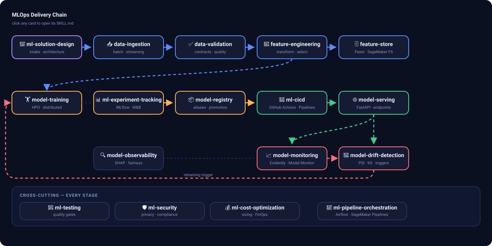
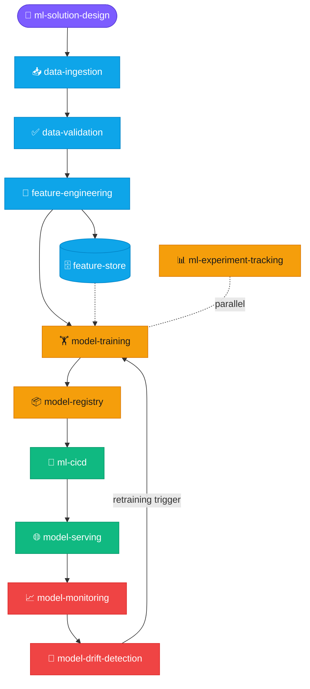
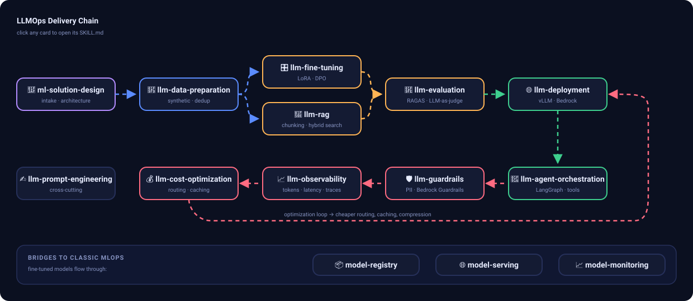
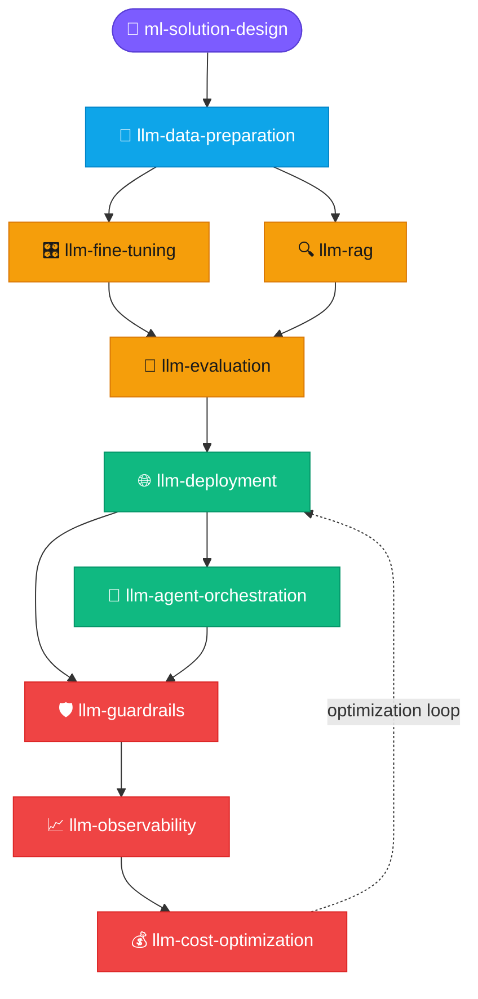

# MLOps & LLMOps Agent Skills

A comprehensive collection of **27 Agent Skills** for MLOps and LLMOps, following the
[Agent Skills standard](https://agentskills.io). These skills provide domain-expert
guidance, executable scripts, and reference documentation for the complete ML/LLM lifecycle.

Compatible with: **Claude Code**, **Kiro CLI/IDE**, **Cursor**, **VS Code Copilot**,
**Gemini CLI**, and any agent supporting the Agent Skills format.

## Skills Overview

### MLOps Skills (17)

| Skill | Description |
|-------|-------------|
| `ml-solution-design` | Requirements intake, architecture decisions, reference architectures, proposals |
| `data-ingestion` | Batch/streaming ingestion, ETL/ELT, data lake, versioning |
| `data-validation` | Great Expectations, Pandera, data contracts, quality checks |
| `feature-engineering` | Transformations, encoding, selection, sklearn Pipelines |
| `feature-store` | Feast, online/offline stores, point-in-time joins |
| `ml-experiment-tracking` | MLflow, W&B, experiment comparison, reproducibility |
| `model-training` | HPO (Optuna), distributed training (DDP), mixed precision |
| `model-registry` | Versioning, promotion, lineage, model cards, packaging |
| `ml-cicd` | Model CI, GitHub Actions, SageMaker Pipelines, promotion, rollback |
| `model-serving` | FastAPI, BentoML, Triton, K8s, A/B testing, batching |
| `model-monitoring` | Evidently, Whylogs, performance tracking, alerting |
| `model-drift-detection` | PSI, KS test, chi-squared, retraining triggers |
| `model-observability` | SHAP, LIME, tracing, fairness, prediction logging |
| `ml-pipeline-orchestration` | Airflow, Prefect, Dagster, Kubeflow, ZenML |
| `ml-testing` | Behavioral tests, quality gates, regression, CI/CD |
| `ml-security` | Adversarial robustness, differential privacy, RBAC, PII |
| `ml-cost-optimization` | GPU selection, quantization, spot instances, FinOps |

### LLMOps Skills (10)

| Skill | Description |
|-------|-------------|
| `llm-fine-tuning` | LoRA, QLoRA, PEFT, DPO, SFT, dataset preparation |
| `llm-evaluation` | RAGAS, LLM-as-judge, benchmarks, safety evaluation |
| `llm-deployment` | vLLM, TGI, Ollama, quantization (AWQ/GPTQ/GGUF) |
| `llm-prompt-engineering` | Prompt patterns, templates, versioning, injection defense |
| `llm-rag` | Chunking, embeddings, vector stores, hybrid search, reranking |
| `llm-guardrails` | Input/output validation, PII, toxicity, jailbreak prevention |
| `llm-observability` | Token tracking, latency (TTFT/TPS), LangSmith, feedback |
| `llm-agent-orchestration` | Tool use, LangGraph, CrewAI, memory, human-in-the-loop |
| `llm-cost-optimization` | Model routing, semantic caching, prompt compression, batch API |
| `llm-data-preparation` | Synthetic data, annotation (Argilla), deduplication, quality |

## Delivery Lifecycle

The skills compose into two end-to-end delivery chains — **every node below is clickable**
and jumps to that skill's `SKILL.md`. Each SKILL.md also ends with a "Related skills"
section naming its upstream and downstream neighbors.

### MLOps chain

[](docs/mlops-lifecycle.svg)

<sub>Open the SVG directly for clickable cards + animated flows; the Mermaid source below renders inline with the same click-through.</sub>

<details>
<summary>Mermaid source (inline-rendered fallback)</summary>




</details>

**Cross-cutting** (apply at every stage):
[`ml-testing`](skills/mlops/ml-testing/SKILL.md) quality gates inside ml-cicd ·
[`ml-security`](skills/mlops/ml-security/SKILL.md) adversarial robustness, privacy, compliance ·
[`ml-cost-optimization`](skills/mlops/ml-cost-optimization/SKILL.md) design-time sizing + operational right-sizing ·
[`ml-pipeline-orchestration`](skills/mlops/ml-pipeline-orchestration/SKILL.md) automates the chain as DAGs ·
[`model-observability`](skills/mlops/model-observability/SKILL.md) explainability companion to serving + monitoring

The training → registry → serving → monitoring handoff is specified in
[`ARTIFACT_CONTRACT.md`](skills/mlops/model-registry/references/ARTIFACT_CONTRACT.md).

### LLMOps chain

[](docs/llmops-lifecycle.svg)

<sub>Open the SVG directly for clickable cards + animated flows; the Mermaid source below renders inline with the same click-through.</sub>

<details>
<summary>Mermaid source (inline-rendered fallback)</summary>




</details>

**Cross-cutting**: [`llm-prompt-engineering`](skills/llmops/llm-prompt-engineering/SKILL.md)
(every stage from RAG generation to agent system prompts).
**Bridges to classic MLOps**: fine-tuned LLMs flow through
[`model-registry`](skills/mlops/model-registry/SKILL.md) /
[`model-serving`](skills/mlops/model-serving/SKILL.md) /
[`model-monitoring`](skills/mlops/model-monitoring/SKILL.md) like any other model.

<sub>Legend: 🟣 design · 🔵 data · 🟠 train/evaluate · 🟢 deploy · 🔴 operate — node
click-through works on github.com (Mermaid); the inline links above are the fallback.</sub>

## Installation

### Claude Code

```bash
# Copy skills to your project
cp -r skills/ .claude/skills/

# Or to global skills
cp -r skills/ ~/.claude/skills/
```

### Kiro CLI/IDE

```bash
# Copy to workspace
cp -r skills/ .kiro/skills/

# Or to global skills
cp -r skills/ ~/.kiro/skills/
```

### Other Compatible Agents

Copy the skill folders to the location specified by your agent's skills documentation.

## Skill Structure

Each skill follows the Agent Skills standard:

```
skill-name/
├── SKILL.md           # Instructions and guidance (required)
├── scripts/           # Executable Python/Bash scripts
│   ├── main_tool.py   # Primary automation script
│   └── helper.py      # Supporting script
└── references/        # Detailed reference documentation
    └── REFERENCE.md   # Tool comparisons, deep-dives
```

## Design Principles

- **Platform-agnostic**: Works with any cloud or on-prem setup
- **Framework-inclusive**: PyTorch, TensorFlow, scikit-learn, XGBoost, HuggingFace
- **Practical**: Real code examples, not just theory
- **Production-ready**: Scripts include error handling, logging, CLI interfaces
- **Progressive disclosure**: Quick guidance in SKILL.md, deep details in references

## Testing & Validation

Every skill is continuously tested — see [TEST_RESULTS.md](TEST_RESULTS.md) for the full report:

- **Schema validation**: all 27 skills validated against the Agent Skills specification (`tests/validate_skills.py`)
- **Script tests**: all 55 bundled scripts compile and pass CLI tests (`tests/test_scripts.py`), run automatically in CI on every push
- **Diagram layout**: the lifecycle SVGs above are generated by [`docs/gen_lifecycle_svg.py`](docs/gen_lifecycle_svg.py) and checked by `tests/check_svg_geometry.py`, which flattens every flow wire into segments and fails if any two wires intersect or a wire crosses a card — keeping the diagrams readable as stages are added
- **Accuracy review (2026-07)**: all code examples and technical claims deep-reviewed against current library releases (MLflow 3.x, Evidently 0.7+, Great Expectations 1.x, Airflow 3.x, Prefect 3.x, TRL 1.x, RAGAS 0.2+, LangChain/LangGraph 1.x, SageMaker SDK v3) and current model pricing
- **Live AWS validation**: the model-training, model-registry, and model-serving patterns were executed end-to-end on a real AWS SageMaker account — registry lifecycle 7/7 checks passed, serverless endpoint deploy + invoke 5/5 checks passed. Reproducible scripts in [`tests/aws_validation/`](tests/aws_validation/)

## License

Apache-2.0
